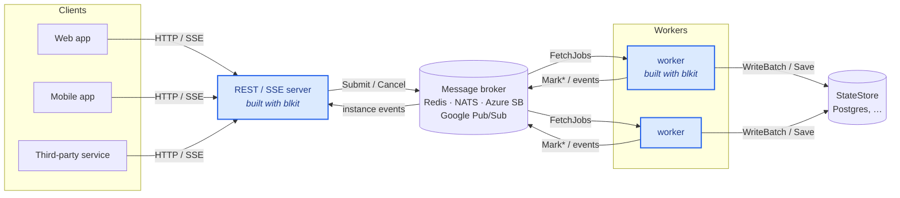

# blkit

**A Go SDK for expressing and executing business logic.**

blkit gives you a typed value system, an expression language, and (on the roadmap) a
full decision-and-process execution stack — so that rules, calculations, and workflows
can be authored as data and run directly inside your Go programs.

---

## What is blkit?

Business logic is usually buried in hand-written `if`/`switch` statements, scattered
across services, and impossible to author or audit by anyone who isn't a Go developer.
blkit pulls that logic out into a first-class, executable model:

- **A typed value system** — numbers (exact decimals), strings, booleans, dates, times,
  durations, lists, dictionaries, and ranges — with consistent, null-aware semantics.
- **An expression language (`bl-expr`)** — write rules and calculations as plain strings
  (`creditScore >= 700 and dti <= 0.40`), compile them once, and evaluate them against
  many inputs.
- **Decision and process layers (planned)** — model decision tables, business knowledge
  models, and BPMN-style process graphs, then execute them with pluggable state,
  message gateways, and a REST/MCP server frontend.

It's built for **developers**, **AI agents**, **low-code / no-code tools**, and
**transpilers** — anything that needs to *generate* and *run* business logic rather than
hard-code it.

blkit draws on established standards — **BPMN 2.0** for processes, **DMN 1.4** for
decisions, and **FEEL** for the expression language — but it is a practical,
self-contained library, not a conformance implementation of any of them.

## Why blkit?

- **Simple, readable business-logic code.** Your business logic stays manageable and
  transparent thanks to an approachable expression language, and business-friendly building
  blocks like decision tables and process flows.
- **Stop re-solving solved problems.** Exact decimal math, null-aware logic, schema and
  type checking, and a ready-made value system come built in, so you write rules instead
  of the boilerplate around them.
- **Robust, safe, and performant.** Strong typing, well-defined semantics, and a
  parse-once / evaluate-many model give you predictable results and concurrency-safe
  execution at scale.
- **A great developer experience.** Easy to pick up, easy to run locally, and easy to
  deploy — no heavyweight runtime or external services required to get going.
- **Flexible about your final product.** Embed it in a larger Go codebase, stand it up as
  a backend microservice, expose it as an MCP tool, drive it from a TUI — the same engine
  fits whatever shape you need.

**Ideal for:** pricing and discount engines, automated decisioning, tax and fee
calculation, eligibility and approval rules, configurable rules engines, and embedding
user- or AI-authored logic into a product.

## Project status

The **expression engine and value system** (the root `blkit` package) is available
today. The higher-level decision and process layers are on the roadmap.

| Component | Package | Status |
|---|---|---|
| Value type system & expression engine (`bl-expr`) | `blkit` (import as `bl`) | ✅ Available |
| Decision models (tables, BKMs, literal expressions) | `blkit.decisions` | 🚧 Planned |
| Process execution (BPMN-style graphs) | `blkit.processes` | 🚧 Planned |
| Data contracts, execution context & state store | `blkit.data` | 🚧 Planned |
| Message gateways (Redis, NATS, in-memory, …) | `blkit.messagegateway` | 🚧 Planned |
| REST server with Server-Sent Events | `blkit.restserver` | 🚧 Planned |
| MCP server | — | 🚧 Planned |

Everything in the **Quickstart** and **Components** sections below works against the
shipped engine. Roadmap features are clearly marked *planned*.

## Install

```bash
go get github.com/friendly-business-machines/blkit
```

Requires **Go 1.22+**.

## Quickstart

Compile an expression once, then evaluate it against typed inputs:

```go
package main

import (
	"fmt"

	bl "github.com/friendly-business-machines/blkit/core"
)

func main() {
	// Optionally declare the shape of the input for parse-time type checking.
	schema, _ := bl.Schema(
		bl.Field{Name: "age", Type: bl.TypeNumber},
		bl.Field{Name: "income", Type: bl.TypeNumber},
	)

	// Parse and compile the rule once; reuse it for many evaluations.
	eligible, _ := bl.Expr(`age >= 18 and income > 50000`, schema)

	// Build a typed input dictionary.
	age, _ := bl.Number(21)
	income, _ := bl.Number(60000)
	inputs, _ := bl.Dictionary(map[string]bl.BlValue{
		"age":    age,
		"income": income,
	})

	// Evaluate. The result is a typed BlValue (here, a BlBoolean).
	result, _ := eligible.Evaluate(inputs)
	fmt.Println(result.String()) // true
}
```

`Expr` accepts a `nil` schema if you don't want type checking. Every result is a
`BlValue`, with a canonical `String()` rendering and a `Type()` tag.

## A worked example: order discounts

Real business rules read naturally as `bl-expr` strings. Here's an order-pricing engine:
several discount rules are evaluated, the matching percentages are collected into a list,
and the single highest discount is applied to the subtotal — with exact decimal money
math.

```go
schema, _ := bl.Schema(
	bl.Field{Name: "tier", Type: bl.TypeString},
	bl.Field{Name: "accountAge", Type: bl.TypeNumber}, // months
	bl.Field{Name: "subtotal", Type: bl.TypeNumber},
	bl.Field{Name: "itemCount", Type: bl.TypeNumber},
	bl.Field{Name: "category", Type: bl.TypeString},
	bl.Field{Name: "code", Type: bl.TypeString},
)

// Each rule contributes its discount when it matches, or 0 when it doesn't.
// `max` picks the single best discount — they don't stack.
discount, _ := bl.Expr(`max([
	(if accountAge >= 12 and tier = "gold" then 0.10 else 0),
	(if accountAge < 3 then 0.10 else 0),
	(if itemCount >= 25 then 0.12 else 0),
	(if subtotal > 500 then 0.08 else 0),
	(if category = "furniture" then 0.06 else 0),
	(if code = "WELCOME20" then 0.20 else 0)
])`, schema)

// Final order total — (1 - discount) is exact, no floating-point drift.
total, _ := bl.Expr(`subtotal * (1 - (`+discount.Source()+`))`, schema)
```

Each `BlExpr` is evaluated against the same order dictionary and returns a typed result.
As the **`blkit.decisions`** layer lands, the same rules will be expressible as a
**decision table** — the tabular form business analysts expect — instead of an inline
list of conditionals.

## Components

blkit is made of three components: **Expressions** for individual rules and calculations,
**Decisions** for composing rules into overall decision logic, and **Processes** for sequencing it
all into multi-step workflows with conditional pathways. The layers build on each other:
expressions are the building blocks of decisions, and decisions are the steps within processes.

### Expressions ✅ *(available today)*

`bl-expr`, a small expression language for writing business rules — built on a proven
[`expr`](https://github.com/expr-lang/expr)-based evaluation engine and a business-focused
type system (exact decimals, dates and durations, null-aware logic). It lives in the root
`blkit` package (imported as `bl`). This is not string-parsing-at-runtime: each expression
is compiled once into bytecode and runs on a stack-based VM, so a `BlExpr` is stateless,
fast, and safe to evaluate against many inputs concurrently — use it directly for a single
rule or calculation, or as the engine the Decisions and Processes components call into.

A few rules that show the kind of business logic `bl-expr` is written for:

```
// Loan eligibility — exact-decimal ratios, no floating-point drift
creditScore >= 700 and debtToIncome <= 0.40

// Tiered classification — a conditional that returns a typed result
if annualSpend > 100000 then "enterprise" else "standard"

// Free shipping — string equality and a numeric threshold together
customerTier = "gold" or orderTotal >= 50

// Fraud screen — `in` membership and null-aware logic: a missing
// priorFlags propagates to null instead of silently passing
claimAmount > 10000 and region in ["EU", "UK"] and priorFlags != null

// Order fulfilment — every line item must be in stock
every line in order.items satisfies line.inStock

// Invoice total — project and roll up a list in one expression
sum(for line in invoice.lines return line.qty * line.unitPrice)
```

Values are arbitrary-precision decimals, full date / time / duration types, lists,
dictionaries and ranges, and every operator is null-aware — missing inputs propagate to
`null` rather than crashing or guessing. Pass a schema to `Expr` and unknown references and
type mismatches are caught at compile time, before any data flows through.

### Decisions 🚧 *(planned)*

A declarative decisioning layer (`blkit.decisions`): **decision tables**, **business
knowledge models**, **literal expressions**, and **boxed contexts**. Instead of an inline
list of conditionals, related rules are expressed as a priority-ordered table that
business analysts can read and maintain. Each cell is a `bl-expr`, so decisions inherit
the expression layer's types and exact-decimal semantics.

### Processes 🚧 *(planned)*

An orchestration layer (`blkit.processes`) for multi-step workflows: BPMN-style graphs of
tasks and gateways, where decision tasks call into the decisions layer and native tasks
call your own Go functions. A `Process` is a **stateless definition** — execution state
(the `ExecutionContext` of variables and the `ExecutionHistory` of steps taken) is passed
in and returned out, so one definition can run concurrently for many independent
executions. Execution is asynchronous, built on goroutines and channels. Surrounding
support — data contracts, a pluggable state store (`blkit.data`), message gateways
(`blkit.messagegateway`), and a REST/SSE server (`blkit.restserver`) — lets processes run
as services.

## Architecture

The components above can be embedded directly in a single Go program. To run processes
*as a service* — many instances, across many machines, surviving restarts — blkit fans
out into a few cooperating roles that communicate **only through a message broker**,
never directly with one another. This keeps every role stateless and independently
scalable.

- **Producers (feeders)** — MCP servers, REST/SSE servers, CLI tools, admin UIs. Using
  the producer-side `MessageGateway` API they *feed* new runs into the system (`Submit`),
  respond to a process's request for input, and cancel or terminate. A producer holds no
  execution state: it hands a `StartRequest` to the broker and gets back a
  `ProcessInstanceID`.
- **Message broker** — Redis/Valkey, NATS, Azure Service Bus, Google Pub/Sub, or an
  in-memory bus for tests and small deployments. The `MessageGateway` interface wraps it,
  presenting a producer-side and a worker-side surface over broker-native primitives. The
  gateway talks only to the broker, never to the state store.
- **Workers** — each `worker.Run` loop registers its **capability set** (the process
  packages linked into its binary), selectively fetches only the jobs it can run, and
  drives each one to completion locally: evaluating the graph, executing tasks as
  goroutines, streaming state to the state store, and publishing instance events back to
  the broker. Workers are stateless and horizontally scalable — add replicas to go faster.
- **State store** — Postgres or another backing store, owned **exclusively by the
  workers**. Execution context and history are persisted here; producers and the broker
  never touch it. Admin and audit reads go straight to the state store.



The **highlighted** nodes — the REST/SSE server and the workers — are the Go binaries you
build with blkit (the REST server is the batteries-included `blkit.restserver`). The
broker, state store, and client frontends are infrastructure you bring; blkit reaches the
broker and state store through pluggable interfaces.

A single Go module can produce many different worker binaries, each importing only the
process packages it should run. Deploy each as its own fleet and the broker's selective
consumption routes the right work to the right pool — all without any worker knowing about
any other.

### Inside a worker

A single `worker.Run` is a handful of cooperating goroutines. The **fetch loop** pulls
only the jobs this binary can run and spawns one **executor** per job; each executor runs
its process to completion, fanning parallel branches out to **task goroutines**. State
never blocks execution: executors hand off `WriteOp`s to an elastic **writer pool** that
batches them to the `StateStore`, while a **heartbeat goroutine** keeps the worker's lease
alive on the broker.


## Documentation

A comprehensive documentation portal (GitHub Pages) with the full type, operator, and
function reference plus worked examples (order discounts, product pricing, invoice
processing, tax calculation, and more) is planned. Until then, this README and the
package doc comments are the reference.

## Dependencies

| Package | Purpose |
|---|---|
| [`github.com/shopspring/decimal`](https://github.com/shopspring/decimal) | Arbitrary-precision decimal arithmetic backing `bl.BlNumber`. |
| [`github.com/expr-lang/expr`](https://github.com/expr-lang/expr) | Expression engine foundation, extended with blkit's own type system, operators, and built-in functions. |

## License

blkit is licensed under the GNU Affero General Public License v3.0. See [LICENSE](LICENSE).
