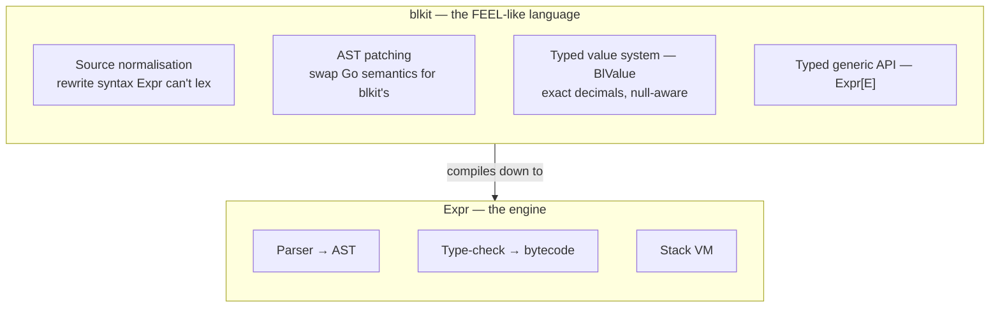
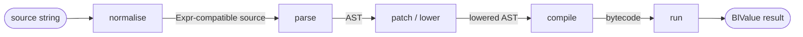

# Expressions

> blkit's expression language: a FEEL-flavoured language for business logic,
> built by extending the Expr engine. Where it comes from, and how it compiles
> and runs.

Expressions are the foundation blkit is built on. A decision rule, a unary test,
the condition that routes a process — all of them are blkit expressions. This
page explains where the language comes from and how the engine compiles and runs
it.

## Expression languages and FEEL

Business logic is full of small, self-contained calculations and conditions:
"is this applicant over 18 and earning more than £25,000?", "what is 20% off
this price?", "does this date fall inside the policy period?". An **expression
language** lets you write these as plain strings —

```text
age >= 18 and income > 25000
```

— compile them once, and evaluate them against many different inputs, instead of
hard-coding each rule as Go control flow.

blkit's language is modelled on **FEEL** (Friendly Enough Expression Language),
the expression language defined by the **DMN** (Decision Model and Notation)
standard. FEEL was designed specifically for business rules, so it has
properties general-purpose programming languages usually lack:

- **Exact decimal arithmetic** — money and percentages don't drift the way
  binary floating point does.
- **Three-valued logic** — a missing value is `null`, and `null` propagates
  through comparisons and boolean operators in a defined way, rather than
  throwing or silently defaulting.
- **Readable, business-friendly syntax** — `between`, ranges like `[1..10]`,
  `if/then/else`, and list comprehensions (`for`, `some`, `every`).

blkit doesn't aim to be a conformant FEEL implementation; it takes FEEL's good
ideas — and its feel — and adapts them to a practical Go library.

## The Expr project

Building a language from scratch means writing a lexer, a parser, a type
checker, a compiler, and an evaluator — and then keeping all of it fast and
correct. blkit doesn't do that. It builds on
[**Expr**](https://github.com/expr-lang/expr) (`expr-lang/expr`), a mature,
widely-used expression engine for Go.

Expr already provides the whole machinery for turning an expression string into
something executable:

- a **lexer and recursive-descent parser** that produce an AST,
- a **type checker** and a **compiler** that lower the AST to bytecode, and
- a fast, embeddable, sandboxed **stack-based virtual machine** that runs it.

What Expr gives you out of the box, though, is a *general-purpose* expression
language with Go-like semantics: native `int`/`float` arithmetic, two-valued
boolean logic, Go types and operators. That is precisely the opposite of the
business-rules semantics FEEL calls for.

## Extending Expr into a FEEL-like language

blkit turns Expr's general-purpose engine into its own FEEL-like language by
intervening at two seams Expr exposes — **before** parsing and **after** parsing
— and by supplying its own type system underneath:



- **Normalisation** rewrites blkit-specific syntax into something Expr's fixed
  lexer can parse — FEEL's single-`=` equality, `if/then/else`, ranges,
  `between`, comprehensions, exact decimal literals.
- **Patching** rewrites the parsed AST so operators and literals mean what
  *blkit* needs them to mean — `+` becomes blkit decimal addition over `BlValue`,
  `and`/`or` become three-valued logic, `[a, b]` becomes a blkit list — rather
  than Expr's Go-flavoured defaults.
- The **value system** (`BlValue`) is the closed set of types every expression
  produces and consumes, so results stay exact and null-aware.

The pay-off: blkit gets its own language, with its own syntax and semantics,
while reusing Expr's battle-tested parser, compiler, and VM. A blkit expression
is ultimately compiled to Expr bytecode and run on the Expr VM.

## How an expression runs

Putting those pieces in order, compiling a source string is a five-stage
pipeline — normalisation and patching are blkit's; parsing, compilation, and
execution are Expr's:



The whole pipeline lives behind one internal function, `compileWithEnv`, which
backs every public constructor:

```go
func compileWithEnv(source string, env any, declared map[string]bool, extra ...expr.Option) (*vm.Program, error) {
    src, err := normalise(source)            // stage 1: normalise
    if err != nil {
        return nil, err
    }
    if name, bad := firstUndefined(src, declared); bad { // undeclared-name check
        return nil, fmt.Errorf("unknown name %s", name)
    }
    opts := buildOptionsEnv(env)             // env + patcher + registrations
    opts = append(opts, extra...)
    return expr.Compile(src, opts...)        // stages 2–4: parse, patch, compile
}
```

### Normalisation

Expr has a fixed lexer; it can't be taught new tokens. So before Expr sees the
source, blkit rewrites the constructs Expr couldn't lex — or would lex with the
wrong meaning — into an equivalent Expr-compatible form, purely as text.
`normalise` is a fixed sequence of small, independent rewrites:

```go
func normalise(source string) (string, error) {
    s := eqNorm(source)            // FEEL `=` → `==`
    s = lowerNamedArgs(s)          // substring(string: x, ...) → positional
    s = lowerInlinePredicates(s)
    s = lowerInlineFunctions(s)
    s = lowerSequence(s)
    s = lowerTableIndex(s)
    s = lowerInstanceOf(s)
    s = lowerIsDefined(s)
    s = rewriteIdentifiers(s)
    s = lowerRanges(s)             // [a..b] → newRange(...)
    s = lowerBetween(s)            // x between a and b → x >= a and x <= b
    s = lowerComprehensions(s)     // for / some / every → map / filter
    s = convertConditionals(s)     // if C then A else B → Expr block form
    s = captureDecimals(s)         // exact decimal-literal capture
    return s, nil
}
```

The output is the same expression, written in the subset of syntax Expr can
parse.

### Parsing

The normalised source goes to `expr.Compile`, which parses it into an AST with
Expr's recursive-descent parser. Operator precedence, associativity, and the
grammar are Expr's. (blkit also calls the parser directly in one place — to walk
the AST and collect the free identifiers for its undeclared-name check.)

### Patching (lowering)

This is where blkit imposes its **semantics**. Parsed `1 + 2` would mean Expr's
`+` — Go integer addition. blkit needs `+` to mean exact decimal addition over
`BlValue`s with null handling. The patcher rewrites the AST to make that so,
walking the tree **post-order** so every operand is already lowered when its
parent operator is visited:

```go
func (p *feelPatcher) Visit(node *ast.Node) {
    switch n := (*node).(type) {
    case *ast.IntegerNode:
        ast.Patch(node, constNode(BlNumber{decimal.NewFromInt(int64(n.Value))}))
    case *ast.StringNode:
        ast.Patch(node, constNode(BlString{n.Value}))
    case *ast.BinaryNode:
        p.patchBinary(node, n)   // + → __add(l, r), < → __lt(l, r), ...
    case *ast.ArrayNode:
        ast.Patch(node, call("__mklist", n.Nodes...)) // [a,b] → BlList, not []any
    // ... unary ops, conditionals, member access, table operations
    }
}
```

The lowering does several jobs:

- **Literals → typed constants.** `42` → a decimal-backed `BlNumber`; `"hi"` → a
  `BlString`; `true` → a `BlBoolean`; `null` → `BlNull`.
- **Operators → dispatch calls.** Each arithmetic/comparison operator maps to a
  named runtime function — `+ → __add`, `< → __lt`, `== → __eq` — each registered
  with a single `BlValue` signature, so an operator's behaviour lives in one
  place.
- **`and`/`or`** lower to let-bound guards implementing three-valued logic
  instead of Go's two-valued `&&`/`||`.
- **`if/then/else`** conditions are wrapped so a `BlValue` condition reduces to a
  Go `bool`, with null and non-boolean conditions treated as falsy.
- **Composite literals and table operations** (`[...]`, `{...}`, filters,
  `groupBy`, `withColumn`) lower to the calls that build the corresponding
  `BlList`, `BlDictionary`, and `BlTable` values.

### Compilation

With the AST lowered, `expr.Compile` type-checks it against the env and emits a
`*vm.Program` — Expr's compiled bytecode. blkit treats the program as an opaque,
reusable unit. On top of Expr's type checking, blkit adds its own discipline:
`firstUndefined` rejects any reference to a name the env doesn't declare, turning
a typo'd variable into a **compile-time** error.

The compiled program is wrapped in the public handle:

```go
type BlExpr[E any] struct {
    source  string      // original text, for Source()
    program *vm.Program // compiled bytecode
}
```

### Evaluation

`Evaluate` runs the stored program on Expr's stack VM, then wraps the result
back into blkit's type system with `asBl`:

```go
func (e *BlExpr[E]) Evaluate(env E) (BlValue, error) {
    out, err := expr.Run(e.program, env)
    if err != nil {
        return nil, &TypeError{Op: "evaluate", Detail: err.Error()}
    }
    return asBl(out), nil
}
```

Because the program is compiled once and the VM holds no state between runs, one
`BlExpr` can be evaluated repeatedly — and concurrently — against different
inputs. The expensive work happens exactly once.

## The value system

Every value the engine produces or consumes implements `BlValue` — the closed
type system the patcher lowers literals into and the operators dispatch over:

```go
type BlValue interface {
    Type() Type                  // language type tag (number, string, ...)
    Equal(other BlValue) BlValue // three-valued equality
    String() string              // canonical literal rendering
    IsNull() bool
    isBlValue()                  // sealed: only blkit can implement it
}
```

Implementations include `BlNumber` (decimal-backed, not float), `BlString`,
`BlBoolean`, the temporal types (`BlDate`, `BlTime`, `BlDateTime`, and the two
durations), and the collections (`BlList`, `BlDictionary`, `BlRange`, `BlTable`).
Numbers use `shopspring/decimal` so business arithmetic is exact, and the
interface is **sealed** so the set of language types is closed and exhaustive
`switch`es over them are safe.

## Typed environments

The variables an expression may reference aren't a loose `map[string]any` —
they're the exported fields of a Go struct, the type parameter `E` in `Expr[E]`:

```go
import bl "github.com/friendly-business-machines/blkit/core"

type applicant struct {
    Age    bl.BlNumber `expr:"age"`
    Income bl.BlNumber `expr:"income"`
}

var eligible, err = bl.Expr[applicant](`age >= 18 and income > 25000`)
var result, _ = eligible.Evaluate(applicant{ /* Age, Income */ })
```

This makes the env part of the compile-time contract:

- An `expr:"name"` tag sets a field's source-level name; an untagged field uses
  its Go name; `expr:"-"` hides it.
- Passing the wrong struct type to `Evaluate` is a **Go compile error**.
- Referencing a name no field declares is a blkit **compile error** (the
  `firstUndefined` check), surfaced when you call `Expr`.

For variable-free expressions (`1 + 1`, `date("2025-01-01")`) there is `NoEnv`
(an alias for `struct{}`) and the `ExprNoEnv` shorthand.

## Beyond single expressions

The same pipeline backs blkit's higher-level constructs; they differ only in how
their env is built and how their result is shaped, then reuse `compileWithEnv`:

| Construct | Adds |
|---|---|
| **`UnaryTest[T]`** | A single-value predicate. A bare `> 5` or `[1..10]` is rewritten against an implicit input, so the test reads as a condition on one value. |
| **`DecisionExpression[I, O]`** | Many named sub-expressions with typed input `I` and output `O`. Entries are compiled, their inter-dependencies found by walking each AST, and evaluated in topological order (cycles and self-references are rejected). |
| **`Func` / `BlUDF[P, R]`** | A named, host-defined function callable by name from other expressions, with compile-time-checked arguments. |

Each is, underneath, one or more compiled programs run on the same VM over the
same value system.

## Source map

| Concept | File |
|---|---|
| Public API, pipeline driver, `BlExpr[E]` | `core/engine.go` |
| Source normalisation (the rewrites) | `core/normalise.go` |
| Undeclared-name check | `core/check.go` |
| AST patching / lowering | `core/patch.go` |
| Operator dispatch functions (`__add`, …) | `core/operators.go` |
| The value system (`BlValue` and implementations) | `core/value.go` |
| Unary tests | `core/unarytest.go` |
| Decision expressions | `core/decision_expression.go` |
| User-defined functions | `core/udf.go` |
| Comprehension lowering | `core/comprehensions.go` |

For the public API itself, see the [Reference](../reference/blkit.md) section.
