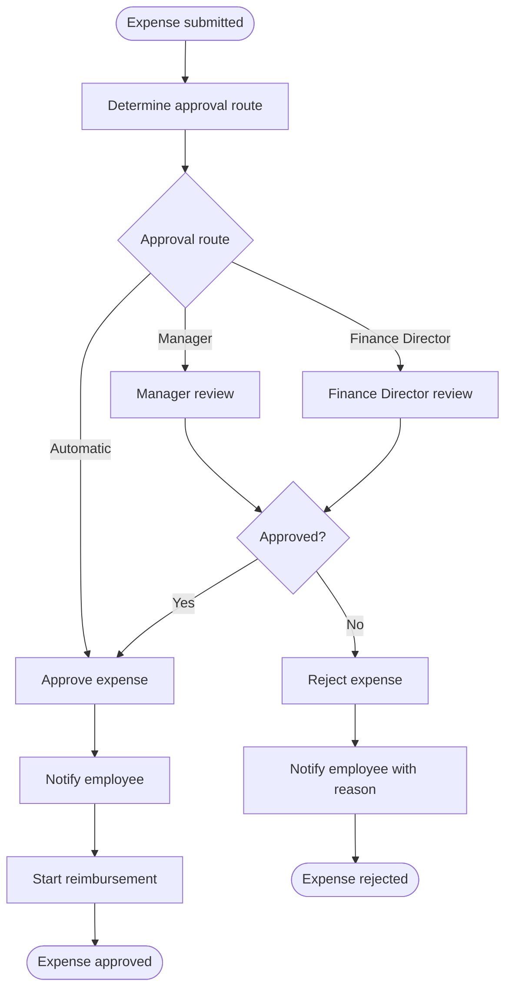

# Employee Expense Approval

> An employee submits a business expense claim; the approval route — automatic,
> manager, or finance director — is determined by amount, category, and the
> employee's seniority, then the matching review runs.

## Business overview

Employees submit expense claims for reimbursement of business costs such as
travel, meals, accommodation, and equipment. The company's expense policy
determines who must approve a claim before it can be reimbursed. Small claims are
approved automatically; larger or higher-risk claims require a human reviewer.

### Expense information

| Field | Description |
|---|---|
| Expense ID | Unique identifier for the claim |
| Employee ID | The employee submitting the claim |
| Employee level | One of: junior, senior, executive |
| Amount | Total claimed amount in company currency |
| Category | One of: meals, travel, accommodation, equipment, other |
| Description | Free-text explanation of the business purpose |
| Receipts | One or more supporting receipt attachments |

### Approval policy

Rules are evaluated in priority order; the first matching rule is applied.

| Priority | Amount | Category | Employee Level | Approval Route |
|---|---|---|---|---|
| 1 | 50 or below | Any | Any | Automatic |
| 2 | 500 or below | Meals, travel, or accommodation | Any | Manager |
| 3 | 500 or below | Equipment or other | Senior or executive | Manager |
| 4 | 2,000 or below | Any | Executive | Manager |
| 5 | 2,000 or below | Any | Any | Finance Director |
| 6 | Above 2,000 | Any | Any | Finance Director |

Rule 6 is a universal catch-all ensuring all claims above 2,000 always reach the
Finance Director regardless of category or employee level.

### Approval routes

- **Automatic approval** — no human review; the claim is approved immediately on
  submission and the employee is notified.
- **Manager review** — sent to the employee's direct line manager, who may
  approve or reject (optionally with a reason). The employee is notified.
- **Finance Director review** — escalated to the Finance Director, who may
  approve or reject. The employee is notified.

### Business process map



### Outcomes

| Outcome | Meaning |
|---|---|
| **Expense Approved** | Claim approved through the applicable route; employee notified; reimbursement proceeds |
| **Expense Rejected** | Claim declined by the reviewer; employee notified with reason |

### Worked examples

| Amount | Category | Employee Level | Approval Route | Example Outcome |
|---|---|---|---|---|
| 30.00 | Meals | Junior | Automatic | Approved immediately |
| 450.00 | Travel | Junior | Manager | Sent to manager for review |
| 450.00 | Equipment | Junior | Finance Director | Escalated to Finance Director |
| 1,200.00 | Other | Executive | Manager | Sent to manager (executive benefit, rule 4) |
| 3,500.00 | Equipment | Senior | Finance Director | Above 2,000; Finance Director required |

## Implementation

!!! warning "Implementation in progress"

    This section is a partial implementation and is subject to change as blkit's
    process engine is completed. The code currently selects the approval route.
    It does not yet run manager or Finance Director review, record approval or
    rejection, notify the employee, or start reimbursement.

Define the JSON transport types and typed decision contract first.

``` { .go .blkit-example title="main.go" }
package main

import (
	"encoding/json"
	"fmt"
	"os"

	bl "github.com/friendly-business-machines/blkit/core"
)

type ExpenseInput struct {
	Amount        string `json:"amount"`
	Category      string `json:"category"`
	EmployeeLevel string `json:"employee_level"`
}

type ExpenseRoute struct {
	Route string `json:"route"`
}

type routeInputs struct {
	Amount   bl.Handle[bl.BlNumber] `expr:"amount"`
	Category bl.Handle[bl.BlString] `expr:"category"`
	Level    bl.Handle[bl.BlString] `expr:"level"`
}
type routeOutputs struct {
	Route bl.Handle[bl.BlString] `expr:"route"`
}
```

The rows follow policy priority exactly.

``` { .go .blkit-example title="main.go" }
var routeTable = bl.NewDecisionTable[routeInputs, routeOutputs](bl.DecisionTableConfig{
	Id: "expense-route", HitPolicy: bl.HitPolicyFirst,
	Columns: []bl.Column{
		{Label: "Amount", Expr: `amount`, Type: bl.TypeNumber},
		{Label: "Category", Expr: `category`, Type: bl.TypeString},
		{Label: "Level", Expr: `level`, Type: bl.TypeString},
	},
	Rules: bl.Rules{
		{`automatic`,           `<= 50`,   `-`,                                  `-`,                     `"Automatic"`},
		{`standard-manager`,    `<= 500`,  `"meals", "travel", "accommodation"`, `-`,                     `"Manager"`},
		{`senior-manager`,      `<= 500`,  `"equipment", "other"`,               `"senior", "executive"`, `"Manager"`},
		{`executive-manager`,   `<= 2000`, `-`,                                  `"executive"`,           `"Manager"`},
		{`finance-under-limit`, `<= 2000`, `-`,                                  `-`,                     `"Finance Director"`},
		{`finance-over-limit`,  `> 2000`,  `-`,                                  `-`,                     `"Finance Director"`},
	},
})
```

The decision task provides the boundary for the complete routing decision. Its
single node is the route table.

``` { .go .blkit-example title="main.go" }
var expenseRouting = bl.NewDecisionTask[routeInputs, routeOutputs](bl.DecisionTaskConfig{
	Id:   "expense-routing",
	Name: "Expense Routing",
})

var _ = expenseRouting.Graph(
	bl.Edge(expenseRouting.In.Amount, routeTable.In.Amount),
	bl.Edge(expenseRouting.In.Category, routeTable.In.Category),
	bl.Edge(expenseRouting.In.Level, routeTable.In.Level),
	bl.Edge(routeTable.Out.Route, expenseRouting.Out.Route),
)
```

The command adapts JSON input to the decision task's typed contract, evaluates the
complete decision, and converts its output back to JSON.

``` { .go .blkit-example title="main.go" }
func main() {
	var input ExpenseInput
	if err := json.NewDecoder(os.Stdin).Decode(&input); err != nil {
		fmt.Fprintln(os.Stderr, err)
		os.Exit(1)
	}
	amount, err := bl.Number(input.Amount)
	if err != nil {
		fmt.Fprintln(os.Stderr, err)
		os.Exit(1)
	}
	category, err := bl.String(input.Category)
	if err != nil {
		fmt.Fprintln(os.Stderr, err)
		os.Exit(1)
	}
	level, err := bl.String(input.EmployeeLevel)
	if err != nil {
		fmt.Fprintln(os.Stderr, err)
		os.Exit(1)
	}
	output, err := expenseRouting.Evaluate(routeInputs{
		Amount:   bl.NewHandle(amount),
		Category: bl.NewHandle(category),
		Level:    bl.NewHandle(level),
	})
	if err != nil {
		fmt.Fprintln(os.Stderr, err)
		os.Exit(1)
	}
	result := ExpenseRoute{Route: output.Route.Get().String()}
	if err := json.NewEncoder(os.Stdout).Encode(result); err != nil {
		fmt.Fprintln(os.Stderr, err)
		os.Exit(1)
	}
}
```

## Notes

- Routing is a decision; the review itself is a process. The decision's output
  (which route applies) selects which review workflow runs.
- A junior's £450 equipment claim falls through rules 2 and 3 (equipment needs
  senior/executive) to land on rule 5 — Finance Director — showing how priority
  ordering interacts with the category and seniority conditions.
