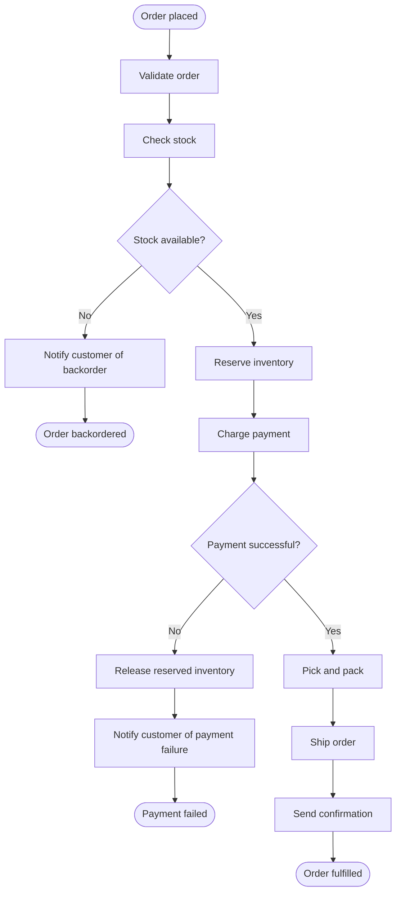

# Order Fulfillment Process

> An e-commerce platform handles an order from placement through stock
> reservation, payment, picking, dispatch, and delivery — with explicit branches
> for out-of-stock and payment-failure cases.

## Business overview

When a customer places an order on an e-commerce platform, the fulfilment
system must:

1. Validate the order (items exist, quantities make sense, address is complete).
2. Check whether the requested stock is available.
3. If stock is available: reserve inventory, charge payment, pick and pack,
   ship, and send a confirmation.
4. If stock is unavailable: notify the customer of a backorder and end.
5. If payment fails: release the reserved inventory, notify the customer, and
   end in error.

### Input

| Field | Type | Description |
|---|---|---|
| `order_id` | `string` | Unique identifier for the order |
| `customer_id` | `string` | Customer placing the order |
| `items` | `list` | List of `{ sku: string, quantity: number }` objects |
| `payment_method_token` | `string` | Tokenised payment instrument |
| `shipping_address` | `object` | `{ line1, city, postcode, country }` |

### Variables produced during execution

| Variable | Set by | Description |
|---|---|---|
| `validation_errors` | Validate Order | List of validation error messages; empty if valid |
| `stock_available` | Check Stock | `true` or `false` |
| `reservation_id` | Reserve Inventory | Identifier for the inventory reservation |
| `payment_ok` | Charge Payment | `true` or `false` |
| `payment_error` | Charge Payment | Error message if payment failed |
| `shipment_id` | Ship Order | Carrier tracking reference |

### Business process map



### Scenarios and expected paths

| Scenario | `stock_available` | `payment_ok` | Terminal node | Description |
|---|---|---|---|---|
| Happy path | `true` | `true` | `end-success` | Order shipped and confirmed |
| Out of stock | `false` | — | `end-backorder` | Customer notified, process ends cleanly |
| Payment declined | `true` | `false` | `end-payment-error` | Stock released, customer notified |

## Implementation

!!! warning "Implementation in progress"

    This section is a partial implementation and is subject to change as blkit's
    process engine is completed. The code currently covers order validation and
    gateway route selection. It does not yet implement the task sequence,
    inventory and payment side effects, compensation, persisted process state,
    or end-event traversal; the completed example will use the process APIs for
    those parts.

``` { .go .blkit-example title="main.go" }
package main

import (
	"encoding/json"
	"fmt"
	bl "github.com/friendly-business-machines/blkit/core"
	"os"
)

type Item struct {
	SKU      string `json:"sku"`
	Quantity int    `json:"quantity"`
}
type Address struct {
	Line1    string `json:"line1"`
	City     string `json:"city"`
	Postcode string `json:"postcode"`
	Country  string `json:"country"`
}
type FulfilmentInput struct {
	OrderID            string  `json:"order_id"`
	CustomerID         string  `json:"customer_id"`
	Items              []Item  `json:"items"`
	PaymentMethodToken string  `json:"payment_method_token"`
	ShippingAddress    Address `json:"shipping_address"`
	StockAvailable     bool    `json:"stock_available"`
	PaymentOK          bool    `json:"payment_ok"`
}
type FulfilmentDecision struct {
	ValidationErrors []string `json:"validation_errors"`
	Route            string   `json:"route"`
}
type routeVars struct {
	Stock   bl.Handle[bl.BlBoolean] `expr:"stock"`
	Payment bl.Handle[bl.BlBoolean] `expr:"payment"`
}
type routeOutputs struct {
	Route bl.Handle[bl.BlString] `expr:"route"`
}

var routeExpression = bl.NewDecisionExpression[routeVars, routeOutputs](bl.DecisionExpressionConfig{
	Id: "fulfilment-route-expression",
	Entries: bl.Entries{
		"route": `if not(stock) then "end-backorder" else if not(payment) then "end-payment-error" else "end-success"`,
	},
})

var routeDecision = bl.NewDecisionTask[routeVars, routeOutputs](bl.DecisionTaskConfig{
	Id:   "fulfilment-route",
	Name: "Fulfilment route",
})

var _ = routeDecision.Graph(
	bl.Edge(routeDecision.In.Stock, routeExpression.In.Stock),
	bl.Edge(routeDecision.In.Payment, routeExpression.In.Payment),
	bl.Edge(routeExpression.Out.Route, routeDecision.Out.Route),
)
```

Validation stays at the application boundary; gateway selection is evaluated by
a typed decision task containing the route expression.

``` { .go .blkit-example title="main.go" }
func DecideFulfilment(in FulfilmentInput) (FulfilmentDecision, error) {
	errors := []string{}
	if in.OrderID == "" {
		errors = append(errors, "order_id is required")
	}
	if in.CustomerID == "" {
		errors = append(errors, "customer_id is required")
	}
	if len(in.Items) == 0 {
		errors = append(errors, "at least one item is required")
	}
	for _, item := range in.Items {
		if item.SKU == "" || item.Quantity <= 0 {
			errors = append(errors, "items require a sku and positive quantity")
		}
	}
	if in.PaymentMethodToken == "" {
		errors = append(errors, "payment_method_token is required")
	}
	if in.ShippingAddress.Line1 == "" || in.ShippingAddress.City == "" || in.ShippingAddress.Postcode == "" || in.ShippingAddress.Country == "" {
		errors = append(errors, "shipping_address is incomplete")
	}
	if len(errors) > 0 {
		return FulfilmentDecision{ValidationErrors: errors, Route: "invalid-order"}, nil
	}
	stock, _ := bl.Boolean(in.StockAvailable)
	payment, _ := bl.Boolean(in.PaymentOK)
	value, err := routeDecision.Evaluate(routeVars{bl.NewHandle(stock), bl.NewHandle(payment)})
	if err != nil {
		return FulfilmentDecision{}, err
	}
	return FulfilmentDecision{ValidationErrors: errors, Route: value.Route.Get().String()}, nil
}
```

``` { .go .blkit-example title="main.go" }
func main() {
	var in FulfilmentInput
	if err := json.NewDecoder(os.Stdin).Decode(&in); err != nil {
		fmt.Fprintln(os.Stderr, err)
		os.Exit(1)
	}
	out, err := DecideFulfilment(in)
	if err != nil {
		fmt.Fprintln(os.Stderr, err)
		os.Exit(1)
	}
	if err = json.NewEncoder(os.Stdout).Encode(out); err != nil {
		fmt.Fprintln(os.Stderr, err)
		os.Exit(1)
	}
}
```

## Notes

- The two gateways branch on boolean variables (`stock_available`, `payment_ok`)
  set by earlier activities — illustrating how process flow is driven by data
  produced during execution.
- The payment-failure branch compensates by releasing the inventory reserved
  earlier, then ends via an **error** end event, distinct from the clean
  backorder end.
