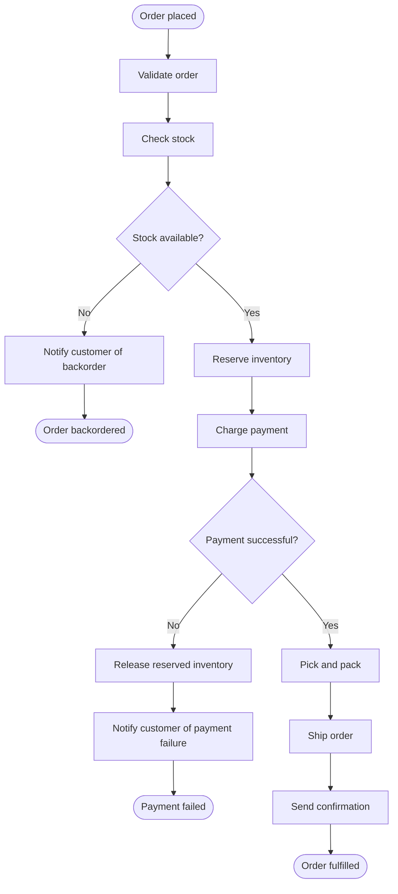

# Example: Order Fulfillment Process

## Business Scenario

When a customer places an order on an e-commerce platform, the fulfilment system must:

1. Validate the order (items exist, quantities make sense, customer address is complete).
2. Check whether the requested stock is available.
3. If stock is available: reserve the inventory, charge payment, pick and pack, ship, and send a confirmation.
4. If stock is unavailable: notify the customer of a backorder and end the process.
5. If payment fails: release the reserved inventory, notify the customer, and end in error.

## Data Model

### Input

| Field | Type | Description |
|---|---|---|
| `order_id` | `string` | Unique identifier for the order |
| `customer_id` | `string` | Customer placing the order |
| `items` | `list` | List of `{ sku: string, quantity: number }` objects |
| `payment_method_token` | `string` | Tokenised payment instrument |
| `shipping_address` | `object` | `{ line1, city, postcode, country }` |

### Variables produced during execution

| Variable | Set by | Description |
|---|---|---|
| `validation_errors` | Validate Order | List of validation error messages; empty if valid |
| `stock_available` | Check Stock | `true` or `false` |
| `reservation_id` | Reserve Inventory | Identifier for the inventory reservation |
| `payment_ok` | Charge Payment | `true` or `false` |
| `payment_error` | Charge Payment | Error message if payment failed |
| `shipment_id` | Ship Order | Carrier tracking reference |

## Business Process Map

## Implementation

The executable portion represents gateway route selection as a [`DecisionTask`](../decision-tasks/decision-task.spec.md) containing one decision expression. Order validation remains at the application boundary; inventory, payment, compensation, and notification activities require the unfinished process engine.

## Scenarios and Expected Paths

| Scenario | `stock_available` | `payment_ok` | Terminal node | Description |
|---|---|---|---|---|
| Happy path | `true` | `true` | `end-success` | Order shipped and confirmed |
| Out of stock | `false` | — | `end-backorder` | Customer notified, process ends cleanly |
| Payment declined | `true` | `false` | `end-payment-error` | Stock released, customer notified |
